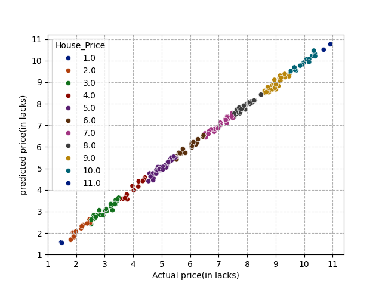

# House-price

# language 
- python

## libraries 
- pandas
- numpy
- matplotlib 
- seaborn
- scikit-learn
- streamlit

# Data
## feature 
- Size
- No of Bedrooms
- No of Bathrooms
- Garage size
- Loot_Area
- Neighbour_Quality
## Target
- House_Price
# Notebook
[Notebook link]('https://www.kaggle.com/code/nagendragouda125/house-price-prediction/edit')
# correlation between features and target

  

# Model Performance 
- MEA :  9136.44(price in range(100000-1000000))
- MSE :  123912358.01
- R²  :  0.998

# Model prediction analysis

  

